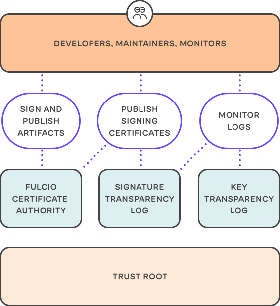

Next up in our blog series about Flux Security is how and why we use
signatures for the Flux CLI and all its controller images and what you
can do to verify image provenance in your workflow.

Since Flux 0.26 our [Security Docs](/docs/security/#signed-container-images)
had this addition:

> The Flux CLI and the controllers\' images are signed using
> [Sigstore](https://www.sigstore.dev/) Cosign and GitHub
> OIDC. The container images along with their signatures are published
> on GitHub Container Registry and Docker Hub.
>
> To verify the authenticity of Flux's container images, install
> [cosign](https://docs.sigstore.dev/cosign/installation/)
> and run:
>
> ```shell
> COSIGN_EXPERIMENTAL=1 cosign verify ghcr.io/fluxcd/source-controller:v0.21.1
>
> Verification for ghcr.io/fluxcd/source-controller:v0.21.1
> The following checks were performed on each of these signatures:>
> - The cosign claims were validated
> - Existence of the claims in the transparency log was verified offline
> - Any certificates were verified against the Fulcio roots.
> ```

We are very pleased to bring this to you and encourage you to make use
of it in your workflows to make your clusters more secure. But let's
unpack everything the above section says.

## Why sign release artifacts in the first place?

Essentially we want you to be able to verify Flux's *image provenance*, which
boils down to making sure that

1. The release you just downloaded actually comes from us, the Flux
   team
1. It hasn't been tampered with

Cryptographic signatures are the go-to choice for this and have been
used for decades, but are not without challenges.

The (excellent) [sigstore docs](https://docs.sigstore.dev/) say this:

> Software supply chains are exposed to multiple risks. Users are
> susceptible to various targeted attacks, along with account and
> cryptographic key compromise. Keys in particular are a challenge for
> software maintainers to manage. Projects often have to maintain a list
> of current keys in use, and manage the keys of individuals who no
> longer contribute to a project. Projects all too often store public
> keys and digests on git repo readme files or websites, two forms of
> storage susceptible to tampering and less than ideal means of securely
> communicating trust.
>
> The tool sets we've historically relied on were not built for the
> present circumstance of remote teams either. This can be seen by the
> need to create a web of trust, with teams having to meet in person and
> sign each others' keys. The current tooling (outside of controlled
> environments) all too often feel inappropriate to even technical
> users.

We are very happy that [sigstore](https://www.sigstore.dev/) exists.
It is a Linux Foundation project backed by Google, Red Hat and Purdue
University striving to establish a new standard for signing, verifying and
provenance checks for the open source community.



The way it works is that our cosign workflow uses

- [cosign](https://docs.sigstore.dev/cosign/overview) to
  sign our release artifacts and store the signatures in an OCI
  registry (GHCR and Docker Hub in our case)
- OpenID Connect (OIDC) beforehand to be identified via our email
  address
- Fulcio, a root certification authority (CA), which issues a
  time-stamped certificate for the identified user that has been
  authenticated
- Rekor, acts as the transparency log storage, where the certificate
  and signed metadata is stored in a searchable ledger, that can't
  be tampered with

That's a lot of terminology and project names, but what's beautiful
about cosign is that you can relatively easily integrate this using
GitHub Actions (see how it was [done in
source-controller](https://github.com/fluxcd/source-controller/pull/550/files)).

## How to verify signatures

If you want to do this manually as an one-off, [install the cosign
tool](https://docs.sigstore.dev/cosign/installation) and
essentially just run

```shell
COSIGN_EXPERIMENTAL=1 cosign verify ghcr.io/fluxcd/source-controller:v0.21.1
```

for the image you want to verify. `COSIGN_EXPERIMENTAL=1` is currently
(cosign version 1.5.1) required to verify the transparency log as well.

Indeed the output says:

```shell
Verification for ghcr.io/fluxcd/source-controller:v0.21.1
The following checks were performed on each of these signatures:
- The cosign claims were validated
- Existence of the claims in the transparency log was verified offline
- Any certificates were verified against the Fulcio roots.
```

Now let's take a look at how to automate this further.

## Enforcing verified signatures in a cluster

Luckily cosign is compatible with and supported by policy engines such
as Connaisseur, Kyverno and OPA Gatekeeper. Let's go with Kyverno for
now. To make sure that Flux image signatures are verified, all you need
to do is add the following manifest:

```yaml
apiVersion: kyverno.io/v1
kind: ClusterPolicy
metadata:
  name: verify-flux-images
spec:
  validationFailureAction: enforce
  background: false
  webhookTimeoutSeconds: 30
  failurePolicy: Fail
  rules:
    - name: verify-cosign-signature
      match:
        resources:
          kinds:
            - Pod
      verifyImages:
```

Now list all the images you want verified. For `helm-controller` for
example, add

```yaml
      - image: "ghcr.io/fluxcd/helm-controller:*"
        repository: "ghcr.io/fluxcd/helm-controller"
        roots: |
          -----BEGIN CERTIFICATE-----
          MIIB9zCCAXygAwIBAgIUALZNAPFdxHPwjeDloDwyYChAO/4wCgYIKoZIzj0EAwMw
          KjEVMBMGA1UEChMMc2lnc3RvcmUuZGV2MREwDwYDVQQDEwhzaWdzdG9yZTAeFw0y
          MTEwMDcxMzU2NTlaFw0zMTEwMDUxMzU2NThaMCoxFTATBgNVBAoTDHNpZ3N0b3Jl
          LmRldjERMA8GA1UEAxMIc2lnc3RvcmUwdjAQBgcqhkjOPQIBBgUrgQQAIgNiAAT7
          XeFT4rb3PQGwS4IajtLk3/OlnpgangaBclYpsYBr5i+4ynB07ceb3LP0OIOZdxex
          X69c5iVuyJRQ+Hz05yi+UF3uBWAlHpiS5sh0+H2GHE7SXrk1EC5m1Tr19L9gg92j
          YzBhMA4GA1UdDwEB/wQEAwIBBjAPBgNVHRMBAf8EBTADAQH/MB0GA1UdDgQWBBRY
          wB5fkUWlZql6zJChkyLQKsXF+jAfBgNVHSMEGDAWgBRYwB5fkUWlZql6zJChkyLQ
          KsXF+jAKBggqhkjOPQQDAwNpADBmAjEAj1nHeXZp+13NWBNa+EDsDP8G1WWg1tCM
          WP/WHPqpaVo0jhsweNFZgSs0eE7wYI4qAjEA2WB9ot98sIkoF3vZYdd3/VtWB5b9
          TNMea7Ix/stJ5TfcLLeABLE4BNJOsQ4vnBHJ
          -----END CERTIFICATE-----

```

The certificate copied here is the [root certificate of Fulcio, the
sigstore CA](https://github.com/SigStore/fulcio#status).
Have a look at
[fluxcd/flux2-multi-tenancy](https://github.com/fluxcd/flux2-multi-tenancy)
to see a more elaborate example and how the Kyverno policies are wired
up there.

By verifying all our artifacts, you ensure their provenance and
guarantee that they haven't been modified from the moment we signed and
shipped them. This is just one more measure we are taking to keep you
more secure.

## Talk to us

We love feedback, questions and ideas, so please let us know your
personal use-cases today. Ask us if you have any questions and please

- join our [upcoming dev meetings](/community/#meetings)
- find us in the \#flux channel on [CNCF Slack](https://slack.cncf.io/)
- add yourself [as an adopter](/adopters/) if you haven't already

See you around!
